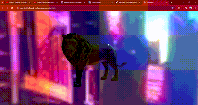

# First Fullstack Python Project in Django

### Description
This project marks my initiation into full-stack web development using Python and Django. It represents a significant milestone in my journey to mastering these technologies and showcases my ability to build robust and dynamic web applications through Self-Teaching.

Throughout this project, I've leveraged Django's powerful features to develop both the backend and frontend components of the application. The project not only serves as a learning experience, but also highlights my creativity and problem-solving skills as I tackle real-world challenges in web development. By combining Python's versatility with Django's framework, I've created a fully functional and scalable web application that embodies my passion for coding and desire to excel in the field.

In this repository, you'll find the culmination of my efforts, showcasing my dedication to mastering full-stack development with Python and Django. Welcome to my first full-stack Python project – an embodiment of my skills, creativity, and enthusiasm for building innovative web solutions.

## Technologies Used
- HTML
- CSS
- JavaScript
- Python
- Augmented Reality

Deployed Site: https://naz-first-fullstack-python-app.onrender.com

GitHub Repo: https://github.com/Batking74/First-FullStack-Python-App